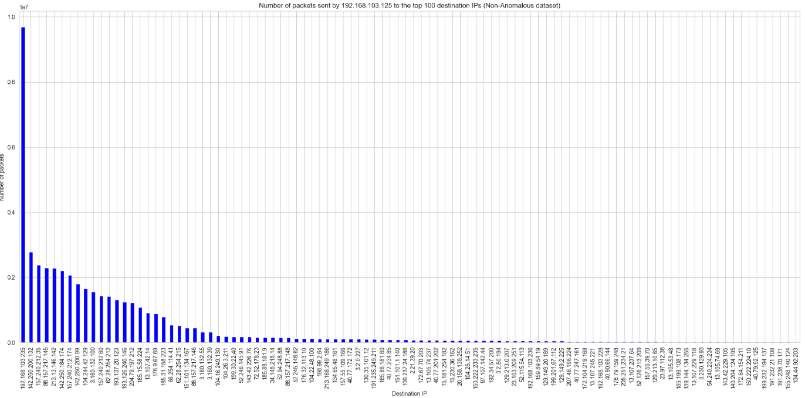
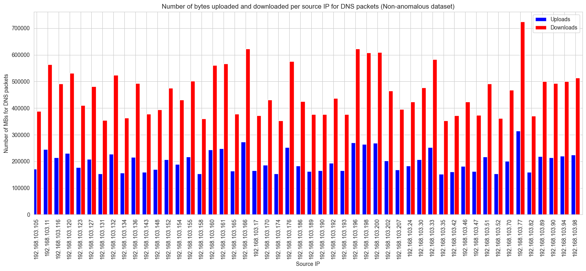

# _Monitoring & SIEM_

## Autores

- Ana Vidal (118408)
- Simão Andrade (118345)

## Estrutura do Relatório

1. Introdução
2. Objetivo
3. Conteúdo utilizado
4. Implementação
    1. Processo de Análise
    2. Análise dos comportamentos anómalos internos
    3. Análise dos comportamentos anómalos do *server dataset* 
    4. Definição das regras SIEM
    5. Teste das regras SIEM e identificação dos dispositivos comprometidos
5. Conclusão

## Introdução

Neste relatório, são abordados os procedimentos e resultados de um projeto cujo objetivo principal é a definição de
regras de Sistema de Gestão de Informação e Eventos de Segurança (SIEM) para a deteção de comportamentos anómalos em
redes de comunicação e a identificação de dispositivos possivelmente comprometidos. A análise foi conduzida utilizando
um conjunto de dados de fluxos de tráfego IP fornecidos.

A análise será conduzida utilizando um conjunto de dados de fluxos de tráfego IP.

## Objetivo

O objetivo principal deste projeto é a definição de regras SIEM para a deteção de comportamentos anómalos em redes de
comunicação e a identificação de dispositivos possivelmente comprometidos. As atividades incluem a análise de
comportamentos não anómalos, a definição de regras SIEM, o teste dessas regras e a identificação de dispositivos
comprometidos.

Na realização deste trabalho, as tarefas a serem realizadas são as seguintes:

- [x] Análise dos comportamentos não anómalos (4 valores):
    - [x] Identificar servidores/serviços internos
    - [x] Descrever e quantificar as trocas de tráfego dos utilizadores internos com os servidores internos e externos
    - [x] Descrever e quantificar trocas de tráfego dos utilizadores externos com os servidores públicos da empresa
- [x] Definição das regras SIEM (6 valores):
    - [x] Respetiva justificação para a deteção de atividades BotNet internas
    - [x] Exfiltração de dados usando HTTPS e/ou DNS
    - [x] Atividades de C&C usando DNS e utilizadores externos usando os serviços públicos empresariais de forma anómala
- [x] Teste das regras SIEM e identificação dos dispositivos com comportamentos anómalos (6 valores).
- [x] Relatório (4 valores)

## Conteúdo utilizado

Para a realização deste trabalho, foram disponibilizados os seguintes ficheiros:

- Datasets: `dataset3.zip`
    - Dataset não anómalo: `dataset3.parquet`
    - Dataset anómalo: `teste3.parquet`
    - Dataset apenas c/ comunicação externa: `servers3.parquet`
- GeoIP_DB: `GeoIP_DB.zip`
    - Base de dados para identificar o *Autonomous System* (rede de IPs de uma organização) de um IP: `GeoIP_ASNum.dat`
    - Base de dados para identificar a localização geográfica de um IP: `GeoIP.dat`

## Implementação

### Processo de Análise

Inicialmente, foi definida uma série de análises a serem realizadas sobre os datasets fornecidos para obter uma visão
geral dos comportamentos a procurar.

- **Inicialmente**:
    - [x] Ip's de origem e destino
    - [x] Portas comuns
    - [x] Protocolos comuns
    - [x] Número de pacotes (por src_ip)
    - [x] Rácio de download/upload (por src_ip)
    - [x] Localização geográfica dos IPs (dos dst_ip para cada src_ip)
    - [x] Domínios DNS visitados (por src_ip)
    - [x] Fazer mais análise às comunicações internas (src_ip e dst_ip)
    - [x] Número de conexões por ~~hora~~ (por src_ip)
- **Seguidamente**:
    - [x] Detetar atividades de BotNet (número de conexões por hora)
    - [x] Detetar exfiltração de dados (Taxas anómalas de transferência de dados)
    - [x] Detetar atividades de C&C (número e tamanho de pacotes DNS anómalo)
- **Finalmente**:
    - [x] Identificar dispositivos comprometidos (identificar os IPs que violam as regras definidas)
    - [x] Tentar identificar o tipo de comprometimento (BotNet, exfiltração de dados, C&C)
    - [x] Justificar a identificação dos dispositivos comprometidos

## Análise dos comportamentos anómalos

No dataset não anómalo, são analisados os comportamentos não anómalos dos utilizadores internos e das suas comunicações
com a rede interna e com as redes externas.

### Protocolos utilizados

Os gráficos apresentados ilustram a distribuição dos pacotes de dados entre os protocolos de transporte TCP e UDP, tanto
no dataset não anómalo quanto no dataset anómalo.

<div style="display: flex; justify-content: center;">
    
    
</div>
<p align="center">
    <i> Figura 1: Protocolos utilizados no _dataset_ não anómalo (esquerda) e anómalo (direita)</i>
</p>

**Gráfico 1**: Protocolos Utilizados (Dataset Não Anómalo)

No gráfico à esquerda, que representa o dataset não anómalo, observa-se que a maioria dos pacotes de dados utiliza o
protocolo TCP.

- **TCP**: Representa cerca de 88,06% do tráfego total.
- **UDP**: Representa cerca de 11,94% do tráfego total.

Esta distribuição é consistente com a utilização típica de redes corporativas, onde o TCP é amplamente utilizado para
garantir a entrega confiável de dados, como em aplicações de _email_, navegação na _web_ e transferências de arquivos. O
UDP, sendo um protocolo sem conexão, é utilizado em aplicações que requerem baixa latência, como _streaming_ de vídeo e
áudio, jogos _online_, e algumas comunicações em tempo real.

**Gráfico 2**: Protocolos Utilizados (Dataset Anómalo)

No gráfico à direita, referente ao dataset anómalo, observa-se uma distribuição semelhante, mas com algumas ‘nuances’
que
podem indicar mudanças no comportamento da rede:

- **TCP**: Continua a ser o protocolo predominante, representando uma grande parte do tráfego.
- **UDP**: Mantém uma presença significativa, embora existam variações no volume de pacote comparado ao dataset não
  anómalo (+7%).

##### Conclusões

Qualquer variação significativa na proporção entre TCP e UDP no dataset anómalo, com comparação com o dataset não
anómalo, pode indicar mudanças no padrão de utilização da rede. Estas mudanças podem ser indicativas de atividades
suspeitas.

### Portas utilizadas

Os gráficos apresentados mostram a análise das portas utilizadas, com uma comparação entre os datasets não anómalo e
anómalo.

<div style="display: flex; justify-content: center;">
    
    
</div>
<p align="center">
    <i> Figura 2: Portas utilizadas no _dataset_ não anómalo (esquerda) e anómalo (direita)</i>
</p>

**Gráfico 1**: Portas Utilizadas (Dataset Não Anómalo)

No gráfico à esquerda, referente ao dataset não anómalo, observa-se uma predominância clara do tráfego HTTPS, seguido
por DNS. Especificamente:

- **HTTPS**: Cerca de 90% dos pacotes são HTTPS. Este dado indica um uso intensivo de navegação _web_ segura e serviços
  relacionados, o que é típico em redes corporativas modernas que priorizam a segurança das comunicações.
- **DNS**: O tráfego DNS representa uma porção menor do tráfego total. Este protocolo é essencial para a resolução de
  nomes de domínio, sendo usado para traduzir nomes de domínio em endereços IP.

**Gráfico 2**: Portas Utilizadas (Dataset Anómalo)

No gráfico à direita, que mostra o dataset anómalo, a distribuição das portas utilizadas apresenta algumas diferenças
significativas em relação ao dataset não anómalo:

- **HTTPS**: A proporção de tráfego HTTPS diminuiu ligeiramente, indicando uma mudança no padrão de utilização da
  rede. Esta variação pode ser um sinal de atividades suspeitas, como exfiltração de dados ou comunicação com servidores
  de comando e controlo.
- **DNS**: Há um aumento no número de pacotes DNS, com mais de 7% a mais relativamente ao dataset não anómalo. Este
  aumento pode ser indicativo de atividades anómalas (e.g. DNS flooding) onde inúmeras consultas
  DNS é usado para sobrecarregar um servidor.

#### Conclusões

A comparação entre os dois datasets revela que, enquanto o tráfego HTTPS se mantém elevado em ambos os casos, há
variações significativas no tráfego DNS. Estas variações e a adicação de novas portas podem ser indicativas de
atividades suspeitas.

### Comunicações internas

A análise das comunicações internas é essencial para identificar padrões de tráfego típicos e detetar atividades
anómalas dentro da rede.

Para fazer esta análise foi cruzado as comunicações internas existentes no dataset não anómalo
e no dataset anómalo, definindo um _threshold_ para a ativação de possíveis anomalias, obtendo-se os seguintes
resultados:

```
         src_ip          dst_ip  counts
 192.168.103.11 192.168.103.235    1224
192.168.103.166 192.168.103.235     501
192.168.103.196 192.168.103.235    1748
192.168.103.200 192.168.103.235     826
 192.168.103.77 192.168.103.235    1454
```

<p align="center">
    <i> Tabela 1: Comunicações internas mais frequentes no dataset anómalo (threshold = 4*média)</i>
</p>

Com isto podemos também perceber que estas máquinas mandam maioria do seu tráfego para o mesmo destino, como se pode
verificar no seguinte gráfico:

<div style="display: flex; justify-content: center;">
    
</div>
<p align="center">
    <i> Figura 3: Comunicações internas no dataset anómalo</i>
</p>

#### Conclusões

A análise das comunicações internas revelou que, no dataset anómalo, existem algumas comunicações que ultrapassam o
_threshold definido, o que pode indicar atividades suspeitas, como reconhecimento interno ou preparação para exfiltração
de dados.

### Número de pacotes (por endereço de origem)

Os gráficos abaixo apresentam o número de pacotes enviados pelos 100 principais endereços IP de origem no dataset não
anómalo. Os endereços IPs mais ativos foram identificados e contabilizados, tendo dois endereços com um envio maior.

<div style="display: flex; justify-content: center;">
    
    
</div>
<p align="center">
    <i> Figura 3: Número de pacotes enviados pelos 100 principais endereços IP de origem no dataset não anómalo (esquerda) e anómalo (direita)</i>
</p>

**Gráfico 1**: Número de Pacotes Enviados pelos 100 Principais Endereços IP de Origem (Dataset Não Anómalo)

No gráfico à esquerda, que representa o dataset não anómalo, observa-se que os endereços IP mais ativos foram
identificados e contabilizados. A distribuição do número de pacotes enviados é bastante regular, com um declínio
gradual à medida que se avança para os endereços IP menos ativos.

- **Tendência Geral**: A maioria dos endereços IP envia um número moderado de pacotes, sem picos significativos. Este
  comportamento é consistente com o uso típico de uma rede corporativa, onde a atividade é distribuída de forma
  equitativa entre os utilizadores.

**Gráfico 2**: Número de Pacotes Enviados pelos 100 Principais Endereços IP de Origem (Dataset Anómalo)

No gráfico à direita, referente ao dataset anómalo, a distribuição do número de pacotes enviados pelos 100 principais
endereços IP mostra um padrão semelhante ao do dataset não anómalo, mas com algumas diferenças notáveis:

- **Picos Anómalos**: Dois endereços IP apresentam um número de pacotes enviado extremamente elevado(**195.168.103.125**
  e **192.168.103.90**), muito acima da média observada nos outros endereços IP. Este comportamento pode ser indicativo
  de atividades anómalas (e.g. ataques de negação de serviço (DDoS)).
- **Variação Significativa**: Há uma variação mais acentuada na quantidade de pacotes enviados pelos diferentes
  endereços IP, sugerindo a presença de atividades irregulares ou não autorizadas.

#### Conclusões

Por uma análise detalhada dos comportamentos não anómalos, foi possivel identificar padrões típicos de tráfego para
depois ser possível detetar atividades suspeitas e dispositivos possívelmente comprometidos, com os IPs 195.168.103.125
e 192.168.103.90.

### Rácio de _download_/_upload_ (por endereço de origem)

Os gráficos apresentados mostram a análise do rácio de download/upload por endereço de origem para os datasets não
anómalo e anómalo. Estes gráficos são cruciais para identificar padrões de tráfego e potenciais anomalias na rede.

<div style="display: flex; justify-content: center;">
    
    
</div>
<p align="center">
    <i> Figura 4: Rácio de _download_/_upload_ por endereço de origem no dataset não anómalo (esquerda) e anómalo (direita)</i>
</p>

**Gráfico 1**: Rácio de _download_/_upload_ por Endereço de Origem  (Dataset Não Anómalo)

No primeiro gráfico, que apresenta o número de bytes baixados e enviados por endereço IP de origem no dataset não
anómalo, observa-se que a maioria dos IPs tem um rácio de download maior do que o de upload. Este padrão é esperado
em redes corporativas, onde os utilizadores tendem a baixar mais dados (como atualizações de software, documentos,
etc.) do que enviar.

**Gráfico 2**: Rácio de _download_/_upload_ por Endereço de Origem  (Dataset Anómalo)

No segundo gráfico, referente ao dataset anómalo, verifica-se uma distribuição diferente. Embora a maioria dos IPs
ainda mostre uma quantidade maior de downloads comparada aos uploads, há picos significativos em alguns endereços IP
específicos, indicando uma quantidade anormalmente alta de uploads. Esses picos podem ser indicadores de atividades
suspeitas, como exfiltração de dados, onde um atacante tenta enviar grandes volumes de informação para fora da rede.

<div style="display: flex; justify-content: center;">
    
    
</div>
<p align="center">
    <i> Figura 5: Rácio de _download_/_upload_ por endereço de origem no dataset não anómalo (esquerda) e anómalo (direita) para pacotes DNS</i>
</p>

**Gráfico 3**: Rácio de _download_/_upload_ por Endereço de Origem para Pacotes DNS (Dataset Não Anómalo)

O terceiro gráfico mostra o rácio de download/upload por endereço de origem especificamente para pacotes DNS no
dataset não anómalo. A tendência geral mantém-se semelhante, com a quantidade de downloads superando os uploads.
Este comportamento é típico, dado que as respostas DNS tendem a ser mais volumosas do que as consultas.

**Gráfico 4**: Rácio de _download_/_upload_ por Endereço de Origem para Pacotes DNS (Dataset Anómalo)

No quarto gráfico, referente aos pacotes DNS no dataset anómalo, há novamente picos significativos em alguns endereços
IP, com volumes de upload anormalmente altos.

Estes picos podem sugerir o envio de dados via DNS pode ser usado para encapsular tráfego malicioso dentro de pacotes
DNS e envio de pacotes DNS em excesso (para o download) e envio de informação sensível para fora da rede e ataques C&C (
para o upload).

#### Conclusões

1. Identificação de Padrões de Tráfego Típicos:
    - No dataset não anómalo, o rácio de download/upload segue um padrão típico, com downloads predominantes sobre os
      uploads. Este comportamento é consistente com o uso regular de uma rede corporativa.
2. Deteção de Atividades Anómalas:
    - Nos datasets anómalos, foram identificados picos de upload significativos em determinados endereços IP. Estes
      picos são fortes indicadores de atividades suspeitas, como exfiltração de dados ou comunicação com servidores de
      comando e controlo.
3. Uso de Protocolos:
    - A análise dos pacotes DNS mostra que, no dataset anómalo, há uma variação maior no volume de uploads. Este
      comportamento pode indicar tentativas de ataque de amplificação DNS ou outras atividades maliciosas usando o
      protocolo DNS.
4. Importância da Monitorização Contínua:
    - A identificação de picos anómalos de tráfego em endereços IP específicos destaca a importância da monitorização
      contínua e da definição de regras SIEM eficazes para a deteção precoce de potenciais ameaças.

### Localização geográfica dos IPs

A localização geográfica dos IPs de destino mostra que a maioria do tráfego é direcionada para os Estados Unidos,
seguido por Portugal. Este padrão é esperado, dada a natureza global das comunicações corporativas. Contudo, na análise
do dataset anómalo, surgiram **38** novos países no _dataset_ anómalo, o que pode indicar atividades suspeitas.

```
country_code
US    32.510430
PT    24.892034
NA     1.842787
NL     1.799620
DE     1.693245
        ...    
IQ     0.000193
IS     0.000096
MD     0.000096
VN     0.000096
MX     0.000096
```

<p align="center">
    <i> Tabela 1: Novas localizações geográficas dos IPs de destino no dataset anómalo</i>
</p>

Definindo um _threshold_ de variação de 1% e dentro destes países, destacam-se dois países:

```
   country  variation  is_new
37      RU   0.273937    True
38      UA   0.011370    True
```

<p align="center">
    <i> Tabela 2: Novos países no dataset anómalo (threshold = 1%)</i>
</p>

#### Conclusões

### Domínios DNS visitados

A análise dos domínios DNS visitados pelos utilizadores internos não revelou anomalias significativas:

```
Detected 0 DNS anomalies
DNS Anomalies:
Empty DataFrame
Columns: [timestamp, src_ip, dst_ip, proto, port, up_bytes, down_bytes]
Index: []

Resolved IP Addresses:
Empty DataFrame
```
<p align="center">
    <i> Tabela 1: Anomalias DNS detetadas (pacotes com taxas de download/upload altas)</i>
</p>

## Análise dos Comportamentos do Server Dataset

Agora vamos analisar o tráfico enviado para fora da rede. Deste modo, vamos analisar o número de pacotes por IP, as
portas usadas, o numero total de upload e downloads por IP, número de pacotes enviados por minuto, como também a
consistencia de tráfico ao longo do tempo e o tempo total de tráfico.

### Número de Uploads e Downloads por IP


### Portas Usadas


### Número Total de Pacotes enviados por IPs


### Tráfico por minuto de cada IP


### Taxa de Conexões por IP

Além disso, foi analisado a taxa tempos de conexões por IP para perceber quais IPs tentam estabelecer mais
conexões e quais têm uma taxa de duração de conexão mais elevada.

Obtendo-se os seguintes resultados:

<div style="display: flex; justify-content: center;">
    
</div>
<p align="center">
    <i> Gráfico 1: Taxa de conexões por IP</i>
</p>

Podemos reparar um valor significatipo de comportamento não anómalo, com conexões que duram 10x que o normal, o que pode
ser indicativo de um comportamento anómalo.

```
                     timestamp          src_ip      dst_ip proto  port
index                                                                    
193632 1970-01-01 01:42:29.450  82.155.123.146  200.0.0.11   tcp   443   
644712 1970-01-01 01:13:29.219   82.155.123.47  200.0.0.11   tcp   443   
216472 1970-01-01 01:24:17.012  82.155.123.100  200.0.0.12   tcp   443   
101934 1970-01-01 01:28:57.751  82.155.123.210  200.0.0.12   tcp   443   
310113 1970-01-01 01:30:48.031   82.155.123.62  200.0.0.11   tcp   443   
250014 1970-01-01 01:22:23.773  82.155.123.107  200.0.0.12   tcp   443   
23386  1970-01-01 01:16:11.089   82.155.123.99  200.0.0.12   tcp   443 
```

<p align="center">
    <i> Tabela 1: Conexões com tempo de duração anómalo</i>
</p>

Isto deu *flag* aos IPs da rede `82.155.123.0/24`, indicando que a duração das conexões superior a 99% do resto do dataset.
Podendo ser um indicador de um possível ataque, como um ataque slowloris.

Resolvendo o DNS dos seus endereços ip, temos:

```
82.155.123.146 resolves to bl6-123-146.dsl.telepac.pt.
82.155.123.47 resolves to bl6-123-47.dsl.telepac.pt.
82.155.123.100 resolves to bl6-123-100.dsl.telepac.pt.
82.155.123.210 resolves to bl6-123-210.dsl.telepac.pt.
82.155.123.62 resolves to bl6-123-62.dsl.telepac.pt.
82.155.123.107 resolves to bl6-123-107.dsl.telepac.pt.
82.155.123.99 resolves to bl6-123-99.dsl.telepac.pt.
82.155.123.23 resolves to bl6-123-23.dsl.telepac.pt.
82.155.123.135 resolves to bl6-123-135.dsl.telepac.pt.
82.155.123.61 resolves to bl6-123-61.dsl.telepac.pt.
```
<p align="center">
    <i> Tabela 2: Resolução de DNS dos IPs da rede</i>
</p>

Os endereços IP fornecidos resolvem para domínios sob o domínio telepac.pt, que está associado a um serviço DSL (Digital
Subscriber Line) da Telepac, um fornecedor de telecomunicações em Portugal. 

Estes IPs encontram-se listados como 'Abused' no AbuseIPDB, o que pode indicar que estes IPs são usados para um ataque.

#### Estatistica por IP


## Definição das regras SIEM

Nesta secção, são definidas regras SIEM para detetar comportamentos de rede anómalos e dispositivos possivelmente
comprometidos.

As regras seguem a seguinte estrutura:

1. **Detetar**: Descrição da atividade que se pretende detetar.
2. **Justificação**: Razão pela qual a atividade é considerada anómala.
3. **Regra**: Condição que, se verificada, deteta a atividade.

### Regras Identificadas

Foram definidas com base nas análises realizadas e seguem a seguinte estrutura:

1. **Número elevado de pacotes UDP**
    - **Detetar**: _IP Spoofing_, _Port Scanning_, _DDoS_
    - **Justificação**: Um elevado número de pacotes UDP pode indicar atividades maliciosas, já que este protocolo pouco
      usado nas comunicações da rede.
    - **Regra**: Se o número de pacotes UDP ultrapassar 15%, considerar como possível anomalia.
2. **Aparição de portas não esperadas**
    - **Detetar**: Acesso não autorizado, uso de serviços não convencionais.
    - **Justificação**: A utilização de portas inesperadas pode indicar tentativas de acesso não autorizado ou uso de
      serviços que não são comuns na rede.
    - **Regra**: Se surgir uma porta que não é comum na rede, diferente de 443 e 53, considerar como possível anomalia.
3. **Alta percentagem de tráfego enviado por um único utilizador**
    - **Detetar**: Atividades de BotNet, Ataques de DDoS
    - **Justificação**: Um evento de DDoS pode ser detetado se um utilizador enviar uma abundância de tráfego
      para um (ou multiplos) destino, o que pode sobrecarregar o servidor e causar uma interrupção do serviço.
    - **Regra**: Se um utilizador enviar mais de 2% do tráfego total detetar anomalia.
4. **Taxas anómalas de _upload_ de dados (no geral)**
    - **Detetar**: _Data Exfiltration_, Má configuração de serviços, _Malware_/_Ransomware_
    - **Justificação**: A exfiltração de dados é uma técnica comum usada por atacantes para roubar informações
      sensíveis.
      Se um utilizador enviar uma quantidade anormalmente grande de dados para fora da rede, isso pode indicar que
      informações confidenciais são roubadas e a serem enviadas para um servidor externo.
    - **Regra**: Se a variação dos dados enviados em comparação com uma quantidade considerada normal for superior a 1%
      ou menor que -1%, então detetar anomalia.
5. **Taxas anómalas de _download_ de dados via DNS**
    - **Detetar**: DNS tunneling e DNS flooding
    - **Justificação**: A grande taxa de _download_ de dados via DNS pode indicar encapsulamento de outros tipos de
      tráfego através do protocolo DNS. Isto é usado para evitar regras criadas por firewalls ou outros métodos de
      deteção. Outro motivo do grande volume seria uma consulta excessiva de DNS, o que pode indicar uma má configuração
      ou um malware.
    - **Regra**: Se o número de pacotes DNS enviados tiver uma variação superior a 0,8 em comparação com os valores
      normais, então detetar anomalia.
6. **Taxas anómalas de _upload_ de dados via DNS**
    - **Detetar**: Atividades de BotNet e Ataque DNS Amplification
    - **Justificação**: O _upload_ de dados via DNS pode ser usado para enviar informações sensíveis para fora da rede
      por um protocolo que normalmente não é monitorizado. Além disso, o ataque de amplificação DNS é uma
      técnica comum usada por atacantes para sobrecarregar um servidor com tráfego malicioso.
    - **Regra**: Se o número de pacotes DNS enviados tiver uma variação superior a XX em comparação com os valores
      normais, então detetar anomalia.
7. **Taxas altas de comunicação com máquinas localizadas em novos países**
    - **Detetar**: Acesso não autorizado, _Data Exfiltration_
    - **Justificação**: A comunicação com máquinas localizadas em novos países pode indicar que uma das máquinas
      envolvidas foi comprometida e encontra-se a comunicar com um servidor malicioso localizado noutro país.
    - **Regra**: Se a variação de pacotes enviados para um novo pais for superior a 1% em comparação com os valores
      normais, então detetar anomalia.
8. **Número elevado de comunicações internas**
    - **Detetar**: Reconhecimento interno, preparação para _Data Exfiltration_
    - **Justificação**: Um número elevado de comunicações internas, ou seja, mais de 4 vezes a média, pode ser um
      indicativo de reconhecimento interno ou preparação para exfiltração de dados.
    - **Regra**: Se o número de comunicações internas exceder 4 vezes a média, considerar como possível anomalia.
9. **Deteção de Picos Anómalos no Tráfego de _downloads_**
    - **Regra**: Configurar alertas para quando o tráfego de _downloads_ exceder 400,000 bytes num curto período de
      tempo.
    - **Justificação**: Picos significativos no tráfego de _downloads_ podem indicar a transferência de abundância de
      dados, possivelmente devido a _downloads_ massivos ou sincronizações de dados, o que pode ser um
      sinal de atividades suspeitas ou não autorizadas.
10. **Deteção de Picos Anómalos no Tráfego de _uploads_**
    - **Regra**: Configurar alertas para quando o tráfego de _uploads_ exceder 50,000 bytes.
    - **Justificação**: Picos elevados no tráfego de _uploads_ podem indicar a exfiltração de dados ou ‘uploads’
      massivos, o que pode ser uma atividade maliciosa, como o roubo de dados ou a transmissão de informação sensível
      para fora da rede.
11. **Monitorização de IPs Específicos**
    - **Regra**: Manter um monitoramento constante dos IPs 82.155.123.0 devido ao seu comportamento anómalo e picos de
      tráfego.
    - **Justificação**: O ip 82.155.123.0 mostrou padrões de tráfego anómalos, incluindo picos significativos de
      dados. A monitorização contínua ajuda a identificar atividades incomuns e a responder rapidamente a possíveis
      incidentes de segurança.
12. **Alertas de Alta Frequência de Pacotes**
    - **Regra**: Configurar alertas para atividades de alta frequência, como inúmeros pacotes enviados num curto
      intervalo de tempo.
    - **Justificação**: Um elevado número de pacotes num curto período pode indicar ataques de negação de serviço (DoS)
      ou outras atividades maliciosas que tentam sobrecarregar a rede ou comprometer a segurança.

### Dispositivos comprometidos

A lista seguinte apresenta os dispositivos e o número de regras violadas correspondente:

| IP              | Regra 1 | Regra 2 | Regra 3 | Regra 4 | Regra 5 | Regra 6 | Regra 7 | Regra 8 | # |
|-----------------|:-------:|:-------:|:-------:|:-------:|:-------:|:-------:|:-------:|:-------:|:-:|
| 192.168.103.200 |         |         |         |         |         |         |         |    X    | 1 |
| 192.168.103.196 |         |         |         |         |         |         |         |    X    | 1 |
| 192.168.103.185 |         |         |         |         |         |         |    X    |         | 1 |
| 192.168.103.169 |         |         |         |         |         |         |    X    |         | 1 |
| 192.168.103.166 |         |         |         |         |         |         |         |    X    | 1 |
| 192.168.103.125 |         |         |    X    |         |    X    |    X    |         |         | 3 |
| 192.168.103.90  |         |         |    X    |         |    X    |    X    |         |         | 3 |
| 192.168.103.85  |         |         |         |    X    |         |         |         |         | 1 |
| 192.168.103.84  |         |         |         |         |         |         |    X    |         | 1 |
| 192.168.103.77  |         |         |         |         |         |         |         |    X    | 1 |
| 192.168.103.69  |         |         |         |    X    |         |         |         |    X    | 2 |
| 192.168.103.11  |         |         |         |         |         |         |         |    X    | 1 |

Com base nas regras definidas, podemos perceber que os IPs `192.168.103.125` e `192.168.103.90` são os prováveis a
estarem comprometidos.

## Conclusão

Com base nos dados analisados, foi possível identificar padrões típicos de comportamento dentro da rede. Estes padrões
incluem uma predominância de tráfego TCP e HTTPS, com um rácio _download_/_upload_ que favorece o download. Estas
observações são consistentes com o uso regular de uma rede corporativa.

Os principais objetivos deste trabalho foram atingidos com sucesso. Conseguimos identificar os servidores e serviços
internos principais, bem como descrever e quantificar as trocas de tráfego entre utilizadores internos e externos. A
análise detalhada dos comportamentos não anómalos permitiu a definição de regras SIEM fundamentadas, essenciais para a
deteção de atividades anómalas.

No entanto, há áreas que poderiam ser melhoradas. A análise de dados poderia ser aprofundada incluindo mais parâmetros,
como a duração das conexões e o comportamento ao longo do tempo, o que proporcionaria uma visão ainda mais detalhada dos
padrões de tráfego. Além disso, a automação de algumas análises tornaria o processo mais eficiente e menos suscetível a
erros humanos.

Em suma, este trabalho proporcionou uma aprendizagem significativa na análise de tráfego de rede e a implementação de
sistemas de deteção de intrusões. Adquirimos habilidades importantes na análise de grandes volumes de dados de tráfego
de rede para identificar padrões e anomalias, bem como na definição e implementação de regras SIEM eficazes baseadas em
dados concretos. Estes conhecimentos e habilidades adquiridos são fundamentais para futuras análises e implementações em
ambientes reais, proporcionando uma base sólida para a prática da segurança em redes de comunicação.
